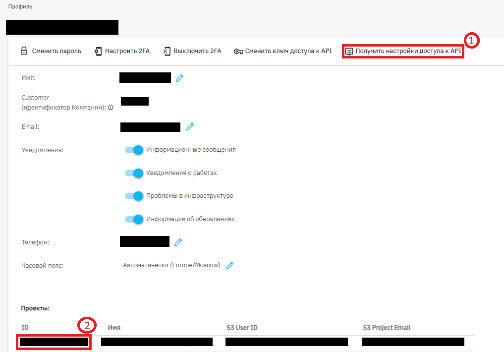

## Первый старт с Terraform

Чтобы развернуть с помощью Terraform инфраструктуру, выполните пошагово следующие действия:

1. Клонируйте репозиторий и перейдите в папку, где находятся файлы конфигурации:

```
git clone https://github.com/Diyckstra/KDouble_InfoSec_First_Terraform.git && cd KDouble_InfoSec_First_Terraform/Terraform
```

2. Скопируйте шаблон переменных окружения с их значениями из файла-примера:

```
cp terraform.tfvars.example terraform.tfvars
```

3. Сперва необходимо перейти в профиль и нажать кнопку `Получить настройки доступа к API`. Затем внесите в файл `terraform.tfvars` следующие изменения:

<h4 align="center">
  
</h4>

    * Переменной `C2_PROJECT` назначить значение из `Профиль -> Проекты -> ID` (1)
    * Переменной `BASE_ACCESS_KEY` назначить значение из файла `c2rc.sh` из переменной `BASE_ACCESS_KEY` (2)
    * Переменной `EC2_SECRET_KEY` назначить значение из файла `c2rc.sh` из переменной `EC2_SECRET_KEY` (2)
    * Переменной `Administrator_SSH_Pub_key` назначить значение своего публичного SSH-ключа (обязательно)
    * Переменной `az` назначить необходимую зону доступности, valid values: `ru-msk-comp1p` / `ru-msk-vol51` / `ru-msk-vol52` 
    * Переменной `vms_count` назначить количество создаваемых виртуалок
    * Переменной `vm_name_prefix` назначить префикс названия
    * Переменной `vm_template` назначить идентификатор образа виртуалки
    * Переменной `vm_instance_type` назначить тип экземпляра
    * Переменной `vm_volume_type` назначить тип диска, valid values: `st2` / `gp2` / `io2`
    * Переменной `vm_volume_size` назначить размер диска
    * Переменной `vm_subnet` назначить идентификатор подсети, в которой будет создан интерфейс виртуалки
    * Переменной `vm_securitygroup` назначить идентификатор группы безопасности, которая будет прикреплена к созданному интерфейсу

4. Выполните команду инициализации:

```
tofu init
```

С её помощью Terraform инициализирует конфигурацию, загрузит все необходимые плагины и будет готов к работе с инфраструктурой.

5. Выполните команду генерирования плана вносимых изменений:

```
tofu plan
```

В терминале будут отображены все изменения, которые Terraform планирует осуществить на реальной инфраструктуре.

6. Тщательно изучите вывод. Если предлагаемые изменения совпадают с ожидаемыми, примените их:

```
tofu apply
```

План будет выведен снова, внимательно проверьте его ещё раз. Для выполнения плана наберите `yes` и нажмите `Enter`.

Через некоторое время в Облаке будет создана вся описанная инфраструктура. В дальнейшем, если потребуется внести в неё изменения, необходимо сделать правки в текущей конфигурации Terraform и повторно применить план.

7. Чтобы ещё раз вывести в терминал значения выходных переменных, введите команду:

```
tofu output
```

8. Если потребуется удалить созданную при помощи Terraform инфраструктуру, это можно сделать следующей командой:

```
tofu destroy
```

В терминале будет отображён план удаления инфраструктуры, а для подтверждения удаления необходимо ввести `yes` и нажать `Enter`.

#### Будьте особенно внимательны при выполнении данной команды — удаляется вся инфраструктура, описанная в конфигурации.

9. Далее необходимо убедиться, что виртуалка запустилась и отображается приглашение ввода логина и пароля в окне консоли облака. Затем перейти в директорию с Ansible и запустить плейбук, это можно сделать следующей командой:

```
cd ../Ansible
ansible-playbook playbook.yml -i inventory.yml
```

Возможные проблемы с подключением на текущем шаге: 
* Виртуалка не загрузилась, необходимо подождать;
* Проблема с использованием приватного SSH-ключа, воспользоваться текущей [подсказкой](https://stackoverflow.com/questions/46610256/chmod-wsl-bash-doesnt-work).
